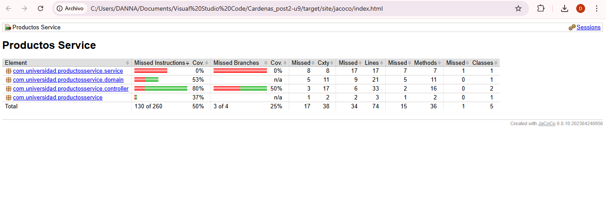
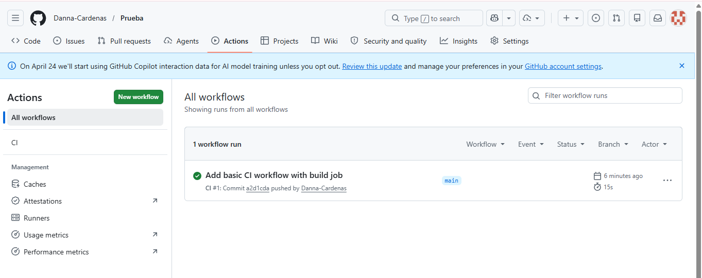

# Productos Service - Post-Contenido 2 (Unidad 9)

## Descripción

Microservicio de gestión de productos con pruebas de integración para la capa de persistencia y la capa web.

## Prerrequisitos

- JDK 21 o superior
- Maven 3.9+
- Git configurado
- Cuenta en GitHub

## Ejecutar las pruebas

```bash
mvn test # Solo pruebas unitarias
mvn verify # Pruebas + reporte JaCoCo
```

## Capturas

### Captura 1


### Captura 2

